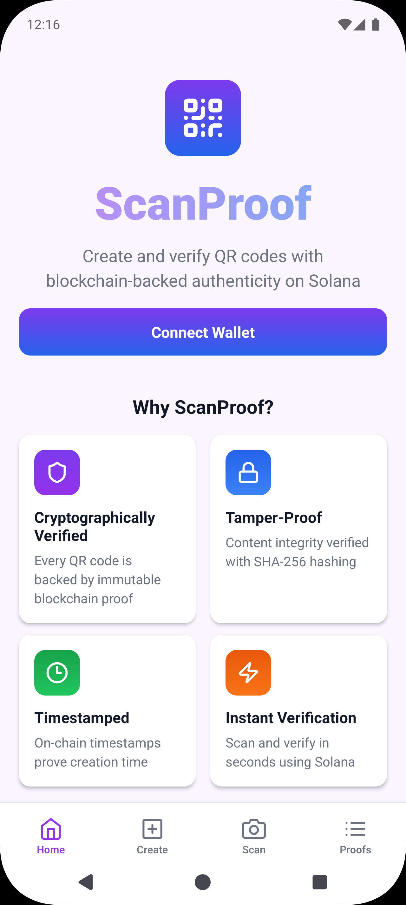
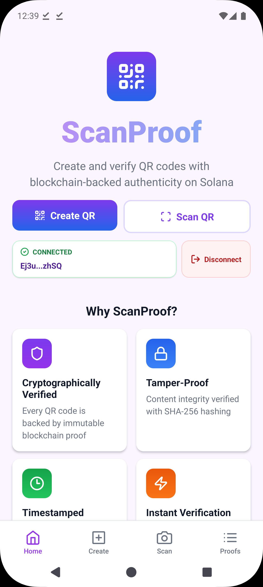
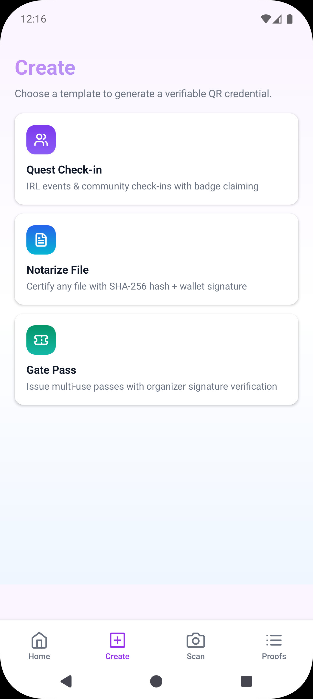
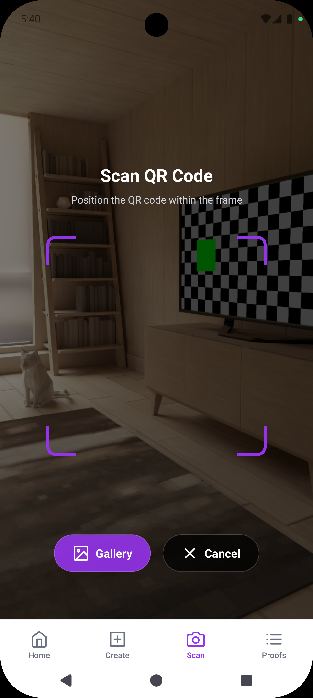
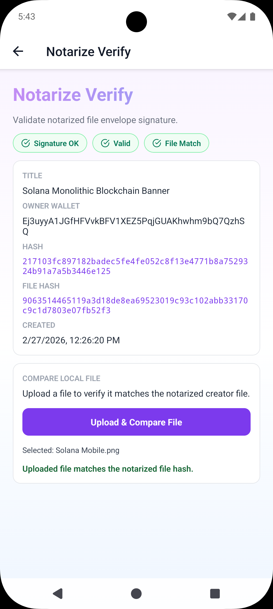
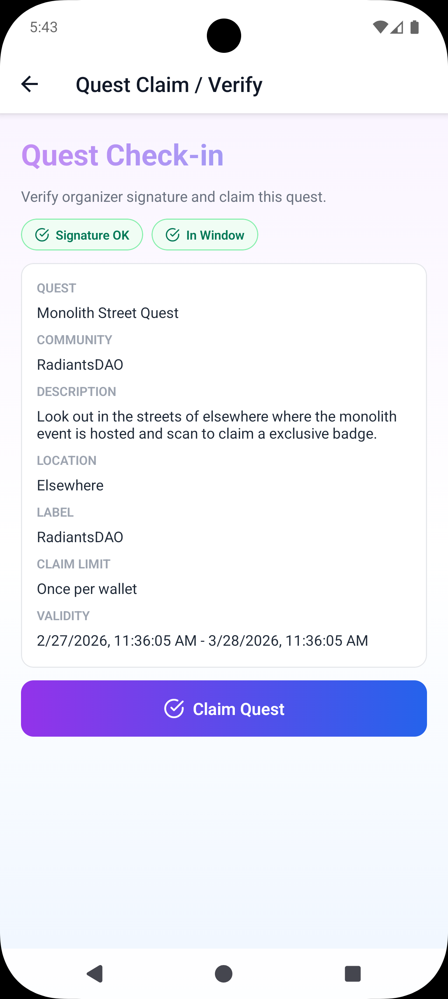
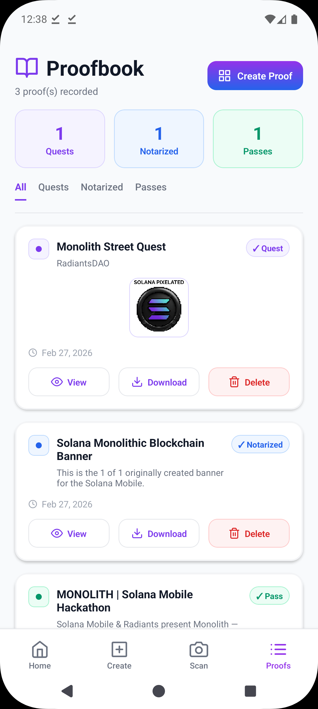
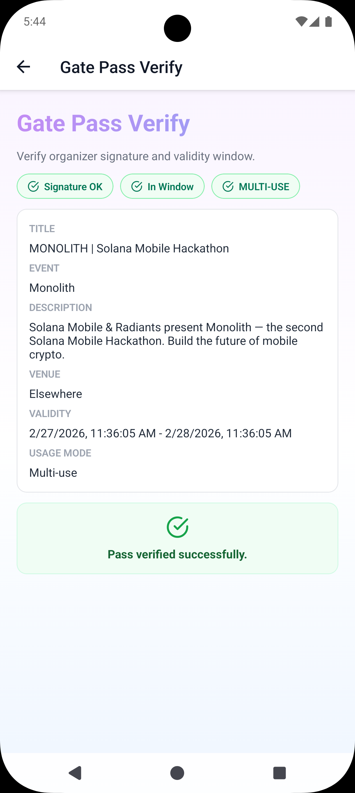

# ScanProof

[](#android-apk-build--release)
[](#tech-stack)
[](#tech-stack)
[](#wallet-flow-mwa)
[](#license)

ScanProof is an Android-first Solana mobile app for issuing and verifying cryptographic QR proofs.
It is designed for mobile-native flows: wallet connect/sign, camera scan, and on-chain confirmation.

## Table of Contents

- [Why ScanProof](#why-scanproof)
- [Screenshots](#screenshots)
- [Core Features](#core-features)
- [Tech Stack](#tech-stack)
- [Architecture](#architecture)
- [Project Structure](#project-structure)
- [Quick Start](#quick-start)
- [Environment Variables](#environment-variables)
- [Wallet Flow (MWA)](#wallet-flow-mwa)
- [Solana Network Flow](#solana-network-flow)
- [QR Envelope Model](#qr-envelope-model)
- [Testing](#testing)
- [Android APK Build & Release](#android-apk-build--release)
- [Troubleshooting](#troubleshooting)
- [Monolith Submission Checklist](#monolith-submission-checklist)
- [Roadmap](#roadmap)
- [Contributing](#contributing)
- [Assumptions to Verify](#assumptions-to-verify)
- [Acknowledgements](#acknowledgements)
- [License](#license)

## Why ScanProof

Seeker users attend events, exchange access rights, and share digital artifacts that often need quick trust checks.
ScanProof provides mobile-first, cryptographic verification in a few taps:

- Connect wallet with Solana Mobile Wallet Adapter (MWA)
- Sign proof envelopes with a real wallet key
- Share/scan QR envelopes for instant verification
- Verify ticket/pass validity using signature + expiration checks

## Screenshots

| Home | Wallet Connect | Create Proof |
|---|---|---|
|  |  |  |

| Scan & Verify | Notarize Checker | Quest Claim |
|---|---|---|
|  |  |  |

| Proofbook | Ticket / Pass Verify | |
|---|---|---|
|  |  | |

## Core Features

### User-facing

- Wallet connect + signed sign-in flow via MWA
- Create proof artifacts with wallet signatures
- QR encode/decode for portable proof envelopes
- Verify envelope integrity and signer authenticity
- Notarize checker flow for proof validation
- Quest claim flow with verification status checks
- Ticket/pass validity verification experiences
- Optional IPFS upload for proof payload storage

### Technical

- Solana RPC integration using `@solana/web3.js`
- Transaction confirmation checks and explorer links
- Canonical JSON + SHA-256 payload hashing
- Local persistence of sessions/proofs via AsyncStorage
- Timeout/error handling around wallet and RPC operations

## Tech Stack

- **Mobile**: React Native, Expo SDK 54, TypeScript
- **Navigation/UI**: React Navigation, Expo Linear Gradient, Lucide icons
- **Wallet**: `@solana-mobile/mobile-wallet-adapter-protocol`
- **Solana**: `@solana/web3.js`
- **Crypto/Encoding**: `tweetnacl`, `bs58`, `js-sha256`, `js-base64`
- **Storage**: `@react-native-async-storage/async-storage`
- **Testing**: Jest + Testing Library

## Architecture

ScanProof follows a service-oriented application layer:

- `screens/`: mobile UI flows and interaction state
- `state/`: app orchestration (`app-state.tsx`) and async action coordination
- `services/`: domain services (wallet, Solana, ticket, proof, verification, IPFS, storage)
- `models/`: typed payloads and envelope data contracts
- `utils/`: hashing, canonical serialization, timeout/error helpers

### Why this architecture

- Keeps wallet/network code isolated from UI rendering
- Enables test coverage of core domain logic
- Supports mobile-first UX iteration without touching protocol internals

## Project Structure

```text
src/
  components/
  config/
  hooks/
  models/
  navigation/
  screens/
  services/
    wallet/
    solana/
    ticket/
    proof/
    verification/
    ipfs/
    storage/
  state/
  types/
  utils/
tests/
  unit/
  integration/
android/
```

## Quick Start

### 1) Prerequisites

- Node.js 20+
- npm 10+
- Java 17 (for Android builds)
- Android Studio + Android SDK
- A Solana wallet app that supports MWA on Android (Phantom, Solflare, Backpack, etc.)

### 2) Install

```bash
npm install
```

### 3) Configure environment

This project reads runtime config from `expo.extra` (`app.json`) and your local `.env`.

Because this repo currently does not include `.env.example`, create `.env` manually in project root:

```bash
# optional for IPFS uploads
PINATA_JWT=
PINATA_API_KEY=
PINATA_API_SECRET=
```

### 4) Run (Android)

```bash
npm run android
```

### 5) Typecheck + tests

```bash
npm run typecheck
npm test
```

## Environment Variables

| Variable | Required | Description | Example |
|---|---|---|---|
| `PHANTOM_REDIRECT_URI` | No | Deep link callback URI for wallet return | `scanproof://wallet-callback` |
| `PHANTOM_APP_URL` | No | App identity URI used for wallet authorization metadata | `https://scanproof.app` |
| `SOLANA_CLUSTER` | No | Solana cluster for app flow | `devnet` |
| `SOLANA_RPC_URL` | No | RPC endpoint override | `https://api.devnet.solana.com` |
| `SOLANA_EXPLORER_BASE_URL` | No | Explorer base for tx links | `https://explorer.solana.com` |
| `IPFS_UPLOAD_URL` | No | Pinata upload endpoint | `https://api.pinata.cloud/pinning/pinJSONToIPFS` |
| `IPFS_GATEWAY_URL` | No | Gateway for CID resolution | `https://gateway.pinata.cloud/ipfs` |
| `PINATA_JWT` | No* | Preferred Pinata auth token | `eyJ...` |
| `PINATA_API_KEY` | No* | Legacy Pinata key auth (if JWT unused) | `pinata_key` |
| `PINATA_API_SECRET` | No* | Legacy Pinata secret auth (if JWT unused) | `pinata_secret` |

`*` Required only if you use IPFS upload features.

## Wallet Flow (MWA)

1. **Connect**: app calls MWA `authorize`.
2. **Session**: wallet account/auth token are persisted locally.
3. **Sign-in**: app requests `signMessages` for challenge verification.
4. **Send transaction**: app prepares unsigned tx, wallet signs/sends via MWA.
5. **Reconnect**: saved session is restored and validated.
6. **Disconnect**: app deauthorizes and clears local session.

Implementation references:

- `src/services/wallet/mwa-wallet-service.ts`
- `src/state/app-state.tsx`

## Solana Network Flow

- Current default cluster: `devnet`
- App verifies ticket/pass authenticity via issuer signature checks
- App verifies validity window using envelope expiration/time-window rules
- Explorer links are used for signature context where available

### Verification lifecycle

`scan ticket/pass` → `decode envelope` → `verify issuer signature` → `check expiration window` → `return validity`

Core service reference:

- `src/services/solana/solana-service.ts`

## QR Envelope Model

Envelope fields include:

- envelope `id`, `type`, `issuerPublicKey`, `issuedAt`
- payload (quest / ticket / notarize metadata)
- signature metadata and signed payload

### Security properties

- Canonical JSON serialization avoids key-order ambiguity
- SHA-256 payload hash for tamper evidence
- Detached signature verification ensures signer authenticity
- Time-window checks enforce validity period constraints

## Testing

### Scope

- Unit tests for hashing, envelope verification, and service logic
- Integration tests for wallet connect/sign flow behavior

### Commands

```bash
npm test
npm run test:watch
```

### Notes

- Tests validate domain logic and service contracts
- Manual device testing is still required for wallet app deep-link behavior

## Android APK Build & Release

### Debug build

```bash
cd android
./gradlew assembleDebug
```

Output:

- `android/app/build/outputs/apk/debug/app-debug.apk`

### Release build

```bash
cd android
./gradlew assembleRelease
```

Output:

- `android/app/build/outputs/apk/release/app-release.apk`

### Release signing checklist

- [ ] Create/upload your production keystore
- [ ] Configure release signing in `android/app/build.gradle`
- [ ] Store secrets securely (not in repo)
- [ ] Verify install/update behavior on clean Android device

## Troubleshooting

### Wallet app does not open

- Confirm wallet app is installed and supports MWA
- Ensure deep link scheme/host matches app config (`scanproof://wallet-callback`)
- Rebuild native project after config updates:

```bash
npx expo prebuild --platform android
```

### Wallet callback fails

- Verify `scheme` and Android `intentFilters` in `app.json`
- Ensure redirect URI in app identity matches wallet request

### RPC timeout or confirmation issues

- Check network connectivity and RPC endpoint health
- Try a different RPC URL in environment config

### IPFS upload fails

- Verify `PINATA_JWT` (or API key/secret pair)
- Confirm upload and gateway endpoints are reachable

### Android build fails

- Validate Java/SDK versions
- Run from clean state:

```bash
cd android
./gradlew clean
./gradlew assembleDebug
```

## Monolith Submission Checklist

- [ ] Functional Android APK attached
- [ ] Public GitHub repository with source code
- [ ] Demo video showing wallet + create + verify + ticket/pass validity checks
- [ ] Pitch deck / brief presentation
- [ ] README updated with architecture + setup + run steps

### Submission Kit

- Final checklist: `docs/submission/00-SUBMISSION-CHECKLIST.md`
- Demo script: `docs/submission/01-DEMO-VIDEO-SCRIPT.md`
- Pitch deck outline: `docs/submission/02-PITCH-DECK-OUTLINE.md`
- Final handoff template: `docs/submission/03-FINAL-HANDOFF.md`

## Roadmap

### Devnet → Mainnet

- Switch cluster and RPC to production endpoints
- Add production wallet compatibility matrix testing
- Harden tx retry and error classification

### Security hardening

- Improve session token lifecycle controls
- Add telemetry for wallet/RPC failure patterns
- Expand signature and envelope abuse-case tests

### dApp Store readiness

- Finalize release signing and package metadata
- Prepare store listing assets/screenshots
- Add compliance/privacy and support pages

## Contributing

1. Fork and create a feature branch.
2. Keep changes scoped and typed.
3. Run typecheck/tests before PR.
4. Open PR with screenshots and testing notes.

## Assumptions to Verify

- Mainnet launch date and production RPC policy
- Final wallet compatibility list required for launch
- Expected legal/compliance disclosures for publishing
- Whether IPFS uploads are mandatory for first public release

## Acknowledgements

- Solana and Solana Mobile ecosystem
- Mobile Wallet Adapter maintainers
- Expo and React Native communities

## License

This project is proprietary and is not licensed for public use.
All rights are reserved by the copyright holder.
See [LICENSE](LICENSE) for terms and permissions.

